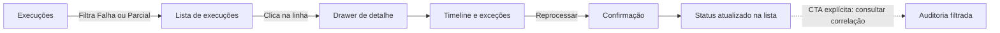
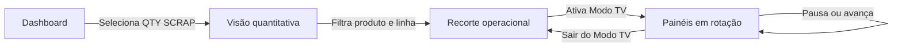

# Personas e fluxos de uso da plataforma Hanaro

## 1. Objetivo

Este documento descreve perfis representativos de uso e demonstra como cada um interage com as telas e componentes do protótipo. As personas não representam restrições de acesso nesta fase. Elas servem para validar prioridades, linguagem, navegação e continuidade dos fluxos.

Princípio adotado: cada tela representa um objetivo de trabalho. Detalhes, edições e confirmações permanecem na tela atual sempre que possível. A troca de módulo acontece somente por uma ação explícita ou por um drill-down coerente iniciado no Dashboard.

## 2. Visão geral das personas

| Persona | Papel representado | Necessidade principal | Frequência esperada |
|---|---|---|---|
| Ana Souza | Analista de Qualidade | Investigar scraps, justificar causas e iniciar ações | Diária |
| Marcos Lima | Administrador do processo | Acompanhar indicadores, targets e relatórios | Diária e mensal |
| Rafael Costa | Desenvolvedor / sustentação | Verificar rotinas, falhas técnicas e rastreabilidade | Sob demanda |
| Juliana Alves | Usuária da linha / acompanhamento visual | Acompanhar quantidade de scrap e prioridades operacionais | Contínua durante o turno |

## 3. Persona 1 — Ana Souza, Analista de Qualidade

### Perfil

- Atua diariamente na investigação das ocorrências de scrap.
- Conhece códigos de componentes, linhas, postos e classificações de causa.
- Precisa analisar vários registros semelhantes sem repetir a mesma justificativa.
- Alterna entre impacto em unidades e em valor para determinar prioridade.

### Objetivos

- Encontrar rapidamente a origem de um desvio.
- Comparar o impacto absoluto e relativo.
- Justificar um ou vários registros.
- Formalizar causa raiz, ação corretiva e responsável.
- Preparar informações confiáveis para o relatório.

### Dificuldades que a experiência deve evitar

- Perder filtros ao abrir um registro.
- Ser enviada para outra tela apenas para consultar um detalhe.
- Repetir a mesma justificativa em vários registros.
- Confundir valores simulados com resultados homologados.

### Fluxo principal — investigar e justificar um desvio

```mermaid
flowchart LR
    A[Dashboard] -->|Clica em uma barra de linha ou componente| B[Base de Scrap filtrada]
    B -->|Seleciona registros| C[Barra de seleção]
    C -->|Revisar selecionados| D[Workspace de revisão na própria Base]
    D -->|Preenche causa e ação| E[Validação dos campos]
    E -->|Concluir revisão| F[Base atualizada]
    F -.->|Ação explícita e opcional| G[Plano de ação relacionado]
```

| Etapa | Tela | Componente utilizado | Interação | Resposta esperada |
|---|---|---|---|---|
| 1 | Dashboard | Filtros de período, produto e linha | Define o recorte da análise | KPIs e gráficos são recalculados |
| 2 | Dashboard | Toggle US$ / QTY SCRAP | Alterna a medida de priorização | Todos os gráficos compatíveis mudam de unidade |
| 3 | Dashboard | Barra do ranking ou Pareto | Clica na categoria crítica | Base abre com o contexto aplicado e identificável |
| 4 | Base de Scrap | Tabela e checkboxes | Seleciona ocorrências semelhantes | Barra de seleção informa quantidade e impacto acumulado |
| 5 | Base de Scrap | Botão “Revisar selecionados” | Inicia a análise em lote | Workspace de revisão abre sem abandonar o contexto da Base |
| 6 | Revisão local | Lista lateral de registros | Alterna o registro ativo | Dados técnicos e formulário são atualizados sem perder a seleção |
| 7 | Revisão local | Classificação, causa raiz e justificativa | Preenche a análise | Campos obrigatórios recebem validação contextual |
| 8 | Revisão local | “Aplicar aos selecionados” | Replica a justificativa compatível | Sistema informa exatamente quais registros serão alterados |
| 9 | Revisão local | “Concluir revisão” | Confirma o trabalho | Toast de sucesso e status atualizado na Base |
| 10 | Base de Scrap | CTA “Abrir plano relacionado” | Decide continuar em outro fluxo | Plano de Ação abre somente mediante escolha explícita |

### Critério de sucesso

Ana conclui uma revisão em lote e retorna à mesma posição da tabela, mantendo filtros, ordenação, página e registros previamente selecionados.

## 4. Persona 2 — Marcos Lima, Administrador do processo

### Perfil

- Acompanha o desempenho consolidado e a preparação das reuniões mensais.
- Precisa comparar ano atual, ano anterior, mês anterior e target.
- É responsável por validar o planejamento anual e distribuir relatórios.
- Usa valores financeiros, mas pode ocultá-los durante apresentações.

### Objetivos

- Entender se o resultado está acima ou abaixo do target.
- Diferenciar alto impacto absoluto de baixa eficiência relativa.
- Revisar targets mensais e seu histórico.
- Preparar, revisar e registrar o envio do relatório.

### Fluxo principal — analisar o mês e preparar o relatório

```mermaid
flowchart LR
    A[Dashboard] --> B[Impacto absoluto]
    B -->|Toggle interno| C[Eficiência relativa]
    C -->|Consulta concluída| D[Configurações: Targets]
    D -->|Salva versão| E[Targets publicados]
    E -->|Acessa pelo menu| F[Relatórios]
    F --> G[Construção]
    G --> H[Preview]
    H --> I[Versão aprovada e envio]
```

| Etapa | Tela | Componente utilizado | Interação | Resposta esperada |
|---|---|---|---|---|
| 1 | Dashboard | Seletor de período e comparação | Seleciona acumulado e ano anterior | KPIs, tendência e referência usam o mesmo recorte |
| 2 | Dashboard | Toggle Impacto absoluto / Eficiência relativa | Troca o tipo de leitura | A tela permanece no Dashboard e substitui apenas o conteúdo analítico |
| 3 | Dashboard | Toggle US$ / QTY SCRAP | Compara custo e quantidade | Fórmula e denominador mudam de forma explícita |
| 4 | Dashboard | Botão de olho | Oculta os valores monetários | KPIs, eixos e tooltips financeiros ficam censurados |
| 5 | Configurações | Aba Targets | Consulta a grade anual | Visualiza target, resultado, atingimento e versão vigente |
| 6 | Configurações | Edição inline / modal | Altera um target simulado | Alteração exige confirmação e gera versão no histórico |
| 7 | Relatórios | Construtor por etapas | Escolhe período, seções, análises e ações | Resumo de conteúdo indica ausências e pendências |
| 8 | Relatórios | Preview | Revisa o relatório mensal | Valores calculados permanecem não editáveis |
| 9 | Relatórios | Aprovação e envio | Registra versão e destinatários | Histórico de versão e envio é atualizado na própria tela |

### Critério de sucesso

Marcos consegue explicar o resultado, confirmar o target utilizado e preparar o relatório sem confundir dados reais da planilha com denominadores simulados do protótipo.

## 5. Persona 3 — Rafael Costa, Desenvolvedor / sustentação

### Perfil

- Atua quando uma rotina automática falha ou produz exceções.
- Precisa diferenciar problema de coleta, validação, conversão e persistência.
- Trabalha com Execution ID, Batch ID, Correlation ID e registros de auditoria.
- Não deve precisar percorrer módulos operacionais para diagnosticar uma falha técnica.

### Objetivos

- Identificar rapidamente a etapa que falhou.
- Examinar exceções e registros afetados.
- Disparar reprocessamento ou contingência.
- Confirmar o resultado por meio da auditoria.

### Fluxo principal — diagnosticar e reprocessar uma execução

| Etapa | Tela | Componente utilizado | Interação | Resposta esperada |
|---|---|---|---|---|
| 1 | Execuções | Filtros de período, origem e status | Seleciona execuções com falha | Lista e indicadores técnicos são atualizados |
| 2 | Execuções | Linha da tabela | Abre uma execução | Drawer apresenta timeline sem retirar Rafael da lista |
| 3 | Drawer de execução | Timeline | Localiza a etapa da falha | Etapa, horário e motivo aparecem associados |
| 4 | Drawer de execução | Tabela de exceções | Consulta registros afetados | Motivo e tratamento de cada exceção ficam visíveis |
| 5 | Drawer de execução | Botão “Reprocessar” | Solicita nova tentativa | Modal resume o escopo antes da confirmação |
| 6 | Execuções | Status e toast | Acompanha o resultado simulado | Linha muda para processando e depois apresenta o novo estado |
| 7 | Execuções | CTA “Consultar correlação” | Inicia investigação técnica complementar | Auditoria abre filtrada pelo Correlation ID |
| 8 | Auditoria | Drawer do evento | Compara antes e depois | Alterações são exibidas sem nova mudança de tela |

### Critério de sucesso

Rafael identifica a causa técnica e conclui o reprocessamento mantendo a lista, os filtros e o detalhe da execução disponíveis. A Auditoria só é aberta quando ele escolhe aprofundar a rastreabilidade.

## 6. Persona 4 — Juliana Alves, usuária da linha

### Perfil

- Consulta o sistema durante a operação e em reuniões rápidas de turno.
- Precisa de informações objetivas, legíveis à distância e sem exposição financeira.
- Sua leitura principal é QTY SCRAP por produto, linha, componente e posto.
- Não realiza justificativas ou configurações durante esse fluxo.

### Objetivos

- Identificar rapidamente a linha ou o posto mais afetado.
- Acompanhar a evolução da quantidade de scrap.
- Exibir o painel em uma TV durante a reunião operacional.

### Fluxo principal — acompanhamento do turno

| Etapa | Tela | Componente utilizado | Interação | Resposta esperada |
|---|---|---|---|---|
| 1 | Dashboard | Toggle QTY SCRAP | Seleciona a leitura em unidades | Elementos financeiros deixam de ser o foco |
| 2 | Dashboard | Filtros de produto e linha | Define o contexto do turno | Rankings, mapa e gráficos refletem o recorte |
| 3 | Dashboard | Mapa de risco | Identifica posto crítico | Cor, quantidade e setor facilitam a leitura rápida |
| 4 | Dashboard | Botão Modo TV | Inicia apresentação | Interface de operação é substituída por painéis de grande formato |
| 5 | Modo TV | Pausar, avançar e intervalo | Controla a apresentação | Rotação responde imediatamente e mantém o painel atual |
| 6 | Modo TV | Sair | Retorna ao Dashboard | Filtros e medida QTY SCRAP são preservados |

### Critério de sucesso

Juliana identifica a prioridade do turno em poucos segundos e consegue apresentar os dados sem revelar valores monetários.

## 7. Regras comuns de interação

### 7.1 Interações que não devem trocar de tela

- Abrir detalhe de registro, componente, alerta, ação, execução ou evento de auditoria.
- Editar campos simples.
- Confirmar uma operação.
- Visualizar histórico, exceções ou registros relacionados.
- Alternar US$ e QTY SCRAP.
- Alternar impacto absoluto e eficiência relativa.
- Trocar abas internas de uma mesma área.

Essas ações devem utilizar drawer, modal, painel expansível, aba ou atualização parcial do conteúdo.

### 7.2 Interações que podem trocar de tela

- Drill-down do Dashboard para uma investigação filtrada.
- Ação explícita “Investigar na Base”.
- Ação explícita “Abrir plano relacionado”.
- Ação explícita “Consultar correlação na Auditoria”.
- Seleção voluntária de outro módulo no menu principal.

### 7.3 Estado que deve ser preservado

- Filtros ativos.
- Ordenação da tabela.
- Página atual da paginação.
- Registros selecionados.
- Unidade US$ ou QTY SCRAP.
- Estado de censura dos valores.
- Tipo de análise absoluta ou relativa.
- Posição de rolagem ao fechar um detalhe.

## 8. Implicações para a implementação Angular

- Cada área principal pode ser uma rota independente.
- Drawers e modais podem usar rotas auxiliares ou query parameters para permitir links diretos sem alterar a percepção de continuidade.
- Filtros e seleções devem permanecer em um serviço de estado por fluxo, evitando perda de contexto ao fechar detalhes.
- Componentes reutilizáveis devem receber dados e emitir intenções; a decisão de navegar pertence ao container da tela.
- A navegação entre módulos deve ocorrer apenas em handlers de CTAs explícitas ou drill-downs documentados.
- O botão Voltar do navegador deve fechar primeiro o estado secundário, como drawer ou revisão, antes de abandonar o módulo principal.

## 9. Componentes reutilizáveis sugeridos

| Componente Angular | Responsabilidade |
|---|---|
| `FilterBarComponent` | Aplicar, apresentar e limpar filtros do fluxo atual |
| `MetricToggleComponent` | Alternar US$, QTY SCRAP e censura monetária |
| `AnalysisModeToggleComponent` | Alternar impacto absoluto e eficiência relativa |
| `KpiCardComponent` | Apresentar valor, contexto, estado e ajuda da fórmula |
| `ChartCardComponent` | Padronizar título, descrição, legenda, tooltip e drill-down |
| `DataTableComponent` | Ordenação, paginação, seleção e estados vazios |
| `DetailDrawerComponent` | Apresentar detalhes sem abandonar a lista |
| `ReviewWorkspaceComponent` | Conduzir revisão individual ou em lote dentro da Base |
| `ConfirmationDialogComponent` | Confirmar alterações de maior impacto |
| `FeedbackToastComponent` | Informar resultado de ações sem interromper o fluxo |
| `MockDataNoticeComponent` | Identificar dados simulados e fonte pendente de homologação |

## 10. Síntese para validação

A quantidade atual de módulos pode ser mantida. O ganho de experiência virá da redução das navegações involuntárias, da preservação de estado e do uso consistente de componentes locais para consulta e edição. O Dashboard continua sendo a principal exceção, pois seus gráficos foram concebidos como pontos de entrada para investigações em outros módulos.
